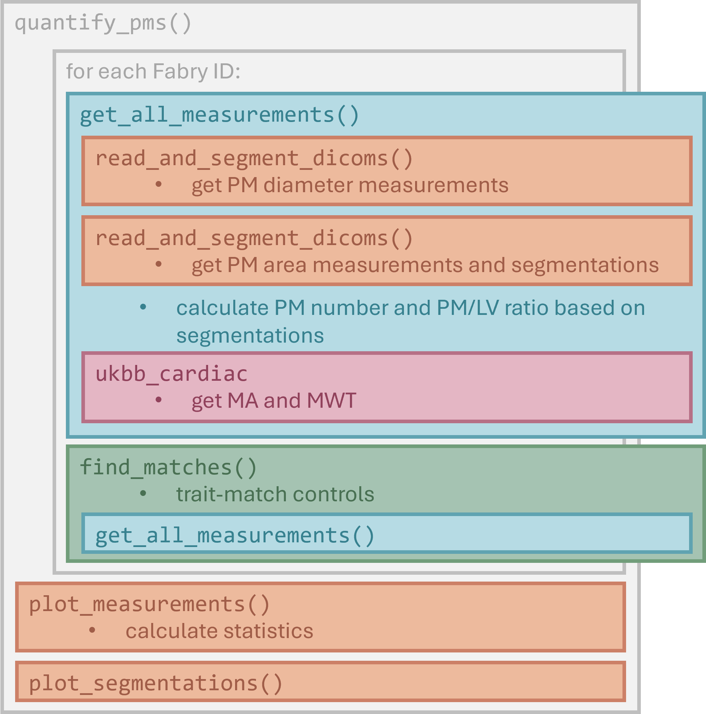

# Quantification of Cardiac Markers for Fabry Disease

This repository contains code for a fully automated image processing pipeline for the recognition and quantification of papillary muscle hypertrophy (PMH) and left ventricular hypertrophy (LVH) from time-resolved 3D short axis CMR scans. Based on the quantification, we are analyzing the diagnostic and prognostic value of several cardiac markers in Fabry disease.

## This Repository

The code in this repository is made for use on the **UK Biobank Research Analysis Platform (UKB RAP)** (`code_ukb/`), but is also available for local use for analysis of data available from our collaborators at the Fabry Center for Inderdisciplinary Therapy (FAZiT) Würzburg (`code_local/`). The code for local use was created for Windows 11 and was not tested on other operating systems, but should be mostly platform-independent.

Both of these folders contain a JupyterNotebook used to run the analysis, a `pmfunctions.py` script containing the functions for segmentation and quantification. The UK Biobank folder also contains a `demo_pipeline_2.py` file for running the `ukbb_cardiac` tool (see below). Both folders also contain a list of all utilized package versions (`pip freeze`) in `requirements.txt`.

For data privacy purposes, we cannot share any data available from the UK Biobank database or data from our collaborators. Instead, we are publishing the results of our measurements and statistical tests, as well as the plots we have created as part of our analyses.

## Analysis Outline

Here is a rough outline of what our pipeline does:

1. Reads and sorts the DICOM files from the UKB RAP into image arrays (adapted from [[1]](#1)), or reads and sorts local data (this step is not published), and selects a central Z slice,
2. Crops the approximate region of the left ventricle using Template Matching,
3. Isolates the blood pool (the left ventricular cavity) and defines the time point of the end-diastole,
4. Segments the papillary muscles (PMs) within the blood pool mask,
5. Quantifies PMH using several metrics (see below),
6. Quantifies LVH using the `ukbb_cardiac` module [[1]](#1), 
7. (Optionally) finds trait-matched controls from a control pool cohort, quantifies the controls,
8. Tests statistics and plots measurements as violin or box plots,
9. Plots segmentations.

Here is a graphical overview of what the main function `quantify_pms()` does:

## Metrics

### PM Diameters
Horizontal and vertical diameters (as published by [[1]](#1)) are calculated in mm. This measurement assumes a classical morphology of two PMs, we are approximating this by selecting the two largest segmented PMs. 

### PM Cross-Sectional Area
Cross-sectional area of the PMs is calculated in mm².

### PM/LV Ratio
The ratio of the PM cross-sectional area to LV (blood pool) cross-sectional area.

### PM Count
As a first attempt at classifying the variable PM morphologies, we are measuring the number of PMs.

### LVH
For the measurement of left ventricular hypertrophy (LVH), we are utilizing the [`ukbb_cardiac`](https://github.com/baiwenjia/ukbb_cardiac) module, a deep learning cardiac segmentation and quantification tool by [[1]](#1). Our fork is available [here](https://github.com/BioMeDS/ukbb_cardiac). We are running the tool with a modified version of their `demo_pipeline.py`. With this, we are quantifying the myocardial cross-sectional area (MA) and the maximum myocardial wall thickness (MWT).

## Feedback

If you found an issue with the code or have trouble with it, please feel free to open an Issue. If you have a good idea for improvement, please reach out to magdalena.schuettler@stud-mail.uni-wuerzburg.de or markus.ankenbrand@uni-wuerzburg.de.

## References

<a id="1">[1]</a> 
Bai, W., Sinclair, M., Tarroni, G., Oktay, O., Rajchl, M., Vaillant, G., Lee, A. M., Aung, N., Lukaschuk, E., Sanghvi, M. M., Zemrak, F., Fung, K., Paiva, J. M., Carapella, V., Kim, Y. J., Suzuki, H., Kainz, B., Matthews, P. M., Petersen, S. E., . . . Rueckert, D. (2018). Automated cardiovascular magnetic resonance image analysis with fully convolutional networks. Journal of Cardiovascular Magnetic Resonance, 20(1), 65. doi: [10.1186/s12968-018-0471-x](https://doi.org/10.1186/s12968-018-0471-x).

<a id="2">[2]</a> 
Cianciulli, T. F., Saccheri, M. C., Llobera, M. N., Balletti, L. R., Beck, M. A., Morita, L. A. & Lax, J. A. (2023). Prevalence of papillary muscle hypertrophy in fabry disease. BMC Cardiovascular Disorders, 23(1). doi: [10.1186/s12872-023-03463-w](https://doi.org/10.1186/s12872-023-03463-w).

